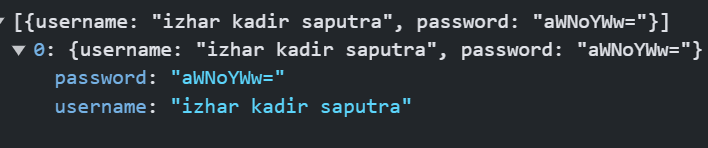
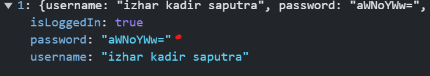

# pemrograman web

tugas untuk menyelesaikan kelas mata kuliah pemrograman web. project ini masih berisi HTML dan javascript, untuk penggunaan CSS hanya di bagian Navbar


## Hosting

saya menggunkan hostingan gratis yang di sediakan oleh layanan Github, untuk link di bawah ini dapat di copy dan paste pada pada browser anda

```bash
 https://izhar-kadir-saputra.github.io/pemogramanWeb/#
```


## localstorage untuk menyimpan data users
untuk nama localstorage dengan key "users"


<br></br>
<br></br>
<br></br>
<br></br>

## data user setelah regis
data user telah registrasi dan belum login


<br></br>
<br></br>
<br></br>
<br></br>


## data user setelah berhasil login
data user telah login maka status login jadi true


<br></br>
<br></br>
<br></br>
<br></be>

## enkripsi password
saya menggunakan enkripsi algoritma password sederhana yang di sediakan oleh javascrip yaitu fungsi "btoa" binar to ASCII


<br></br>
<br></br>
<br></br>
<br></br>

## localstorage books 
untuk nama localstorage dengan key "savedNews"


<br></br>
<br></br>
<br></br>
<br></br>
